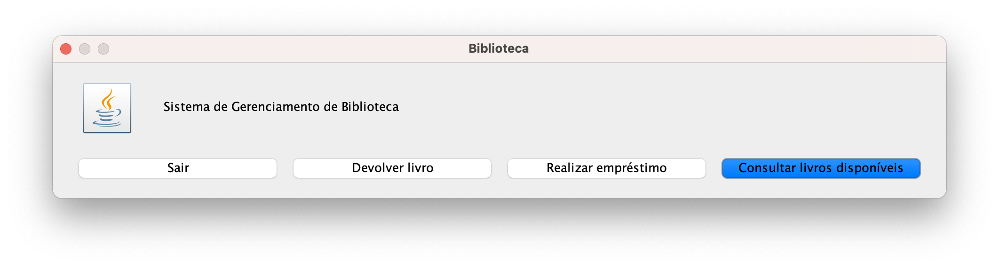
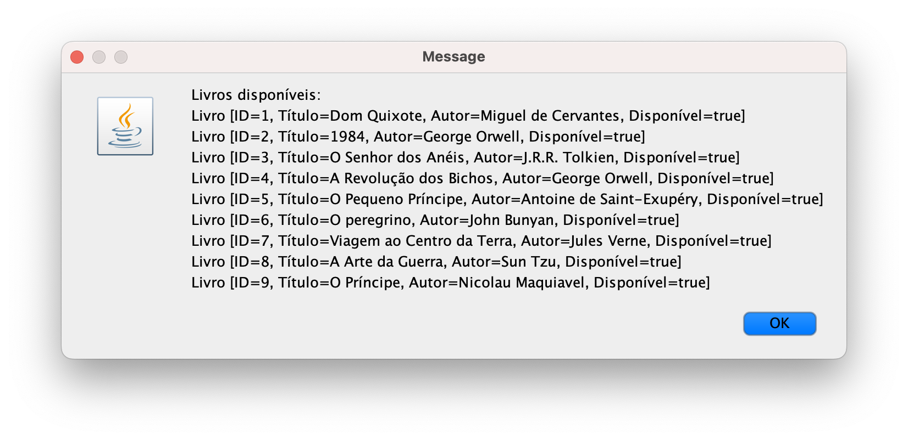
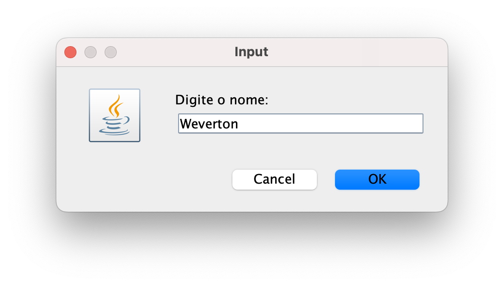
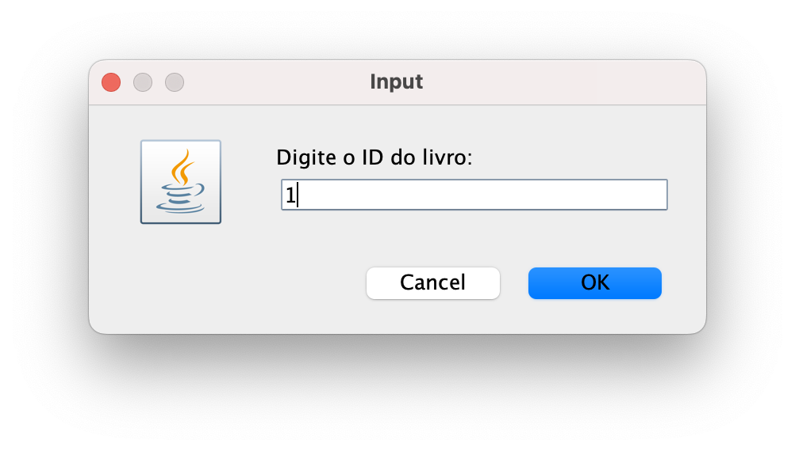
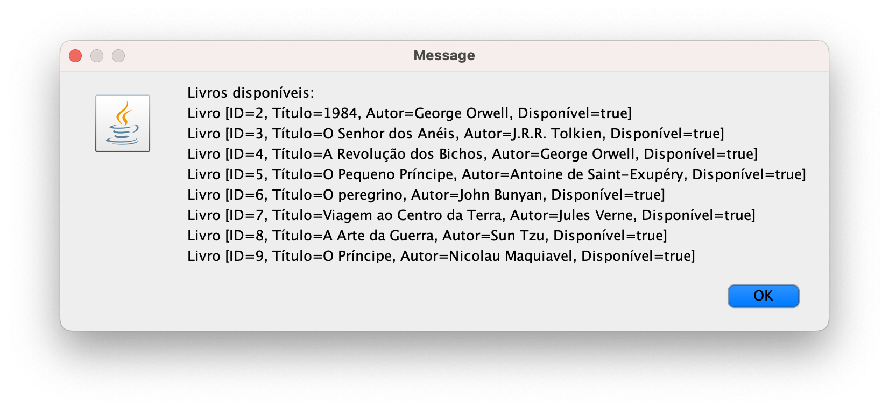
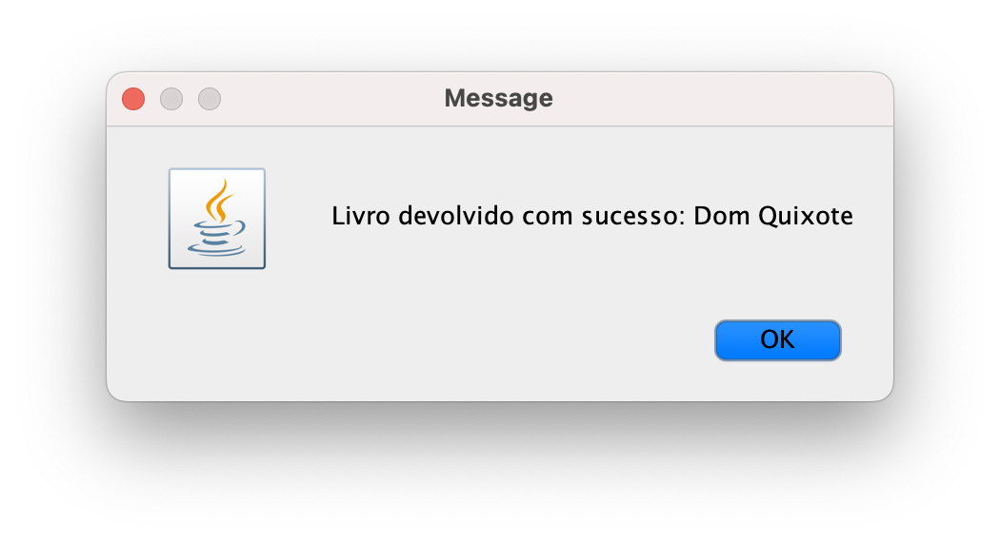

## Sistema de Gerenciamento de Biblioteca

Este projeto é um sistema simples de gerenciamento de biblioteca, feito em Java com Programação Orientada a Objetos (POO). Ele permite consultar itens disponíveis, realizar empréstimos e devolver itens, usando uma interface com JOptionPane.

### Estrutura do Sistema

**Classe ItemBiblioteca (Abstrata)**

Propósito: Define atributos e métodos comuns a todos os itens da biblioteca, como livros ou revistas.  
Atributos:  
id (int, final): Identificador único do item.  
disponivel (boolean): Indica se o item está disponível.

Métodos:  
emprestar(): Marca o item como indisponível.  
devolver(): Marca o item como disponível.  
getId(), isDisponivel(): Acessam os atributos.  
toString() (abstrato): Exige que subclasses implementem sua representação.

**Classe Livro**

Propósito: Representa um livro, herda de ItemBiblioteca e adiciona informações específicas.  
Atributos:  
titulo (String, final): Título do livro.  
autor (String, final): Nome do autor.

Métodos:  
getTitulo(), getAutor(): Acessam os atributos.  
toString(): Exibe os dados do livro (ID, título, autor, disponibilidade).

**Classe Usuario** 

Propósito: Representa uma pessoa que pega itens emprestados, armazenando seus dados e lista de itens.  
Atributos:  
cpf (String, final): CPF do usuário.  
nome (String, final): Nome do usuário.  
itensEmprestados (List, final): Lista de itens emprestados.

Métodos:  
pegarEmprestado(ItemBiblioteca): Adiciona um item à lista e o marca como emprestado.  
devolverItem(ItemBiblioteca): Remove o item da lista e o marca como disponível.  
getCpf(), getNome(), getItensEmprestados(): Acessam os atributos.  
toString(): Exibe os dados do usuário.

**Classe Emprestimo**

Propósito: Registra um empréstimo, associando um item a um usuário.  
Atributos:  
item (ItemBiblioteca, final): Item emprestado.  
usuario (Usuario, final): Usuário que pegou o item.  
dataEmprestimo (LocalDate, final): Data do empréstimo.

Métodos:  
getDetalhes(): Retorna uma descrição do empréstimo.  
Construtor: Associa o item ao usuário e registra o empréstimo.

### Relacionamentos

Associação: Usuario e ItemBiblioteca são associados via Emprestimo. Um usuário pode ter vários itens emprestados (1:N), e um item pode ser emprestado a um usuário por vez.  
Composição: Emprestimo depende de ItemBiblioteca e Usuario, pois só existe com essas instâncias.  
Herança: Livro herda de ItemBiblioteca, permitindo que outros tipos de itens (ex.: revistas) sejam adicionados no futuro.

### Princípios de POO Aplicados

**Encapsulamento:** Atributos são private (ou private final), acessados apenas por getters ou métodos específicos, como emprestar() e devolver() em ItemBiblioteca, ou pegarEmprestado() em Usuario. Isso protege os dados e garante que as regras sejam seguidas (por ex. verificar disponibilidade).

**Herança:** Implementamos a classe abstrata ItemBiblioteca, que define atributos (id, disponivel) e métodos (emprestar(), devolver()) comuns a todos os itens da biblioteca. A classe Livro herda de ItemBiblioteca, adicionando atributos específicos (titulo, autor) e implementando toString(). Isso permite reutilizar código e facilita a adição de novos tipos de itens, como revistas, no futuro.

**Polimorfismo:** O método toString() é sobrescrito em Livro e Usuario para exibir informações específicas. Na classe Main, getDetalhes() de Emprestimo usa esses métodos para mostrar dados de forma consistente, permitindo flexibilidade na exibição.

**Abstração:** As classes abstraem entidades reais: ItemBiblioteca e Livro focam em atributos e status de itens; Usuario em CPF, nome e itens emprestados; Emprestimo em item, usuário e data. A interface com JOptionPane simplifica a interação, escondendo a lógica interna.


### Como Executar

Após clonar o código, navegue até o diretório do projeto:

```
cd LibrarySystem
```

Compile o código:

```
javac -d bin src/*.java src/model/*.java
```

Execute:

```
java -cp bin Main
```

### Fluxo de Uso do Sistema

Tela inicial: O sistema exibe um menu com opções para consultar livros, realizar empréstimo, devolver livro ou sair.



Consultar livros disponíveis: Mostra a lista de livros disponíveis para empréstimo.



Realizar empréstimo - Inserir CPF: O usuário informa o CPF para o empréstimo.


Realizar empréstimo - Inserir nome: O usuário informa o nome.



Realizar empréstimo - Inserir ID do livro: O usuário seleciona o livro pelo ID.



Confirmação do empréstimo: O sistema confirma o empréstimo com os detalhes.
˝


Lista atualizada após empréstimo: A consulta de livros disponíveis reflete que o livro emprestado não aparece mais.



Devolver livro: Após informar CPF e ID do livro, o sistema confirma a devolução.


