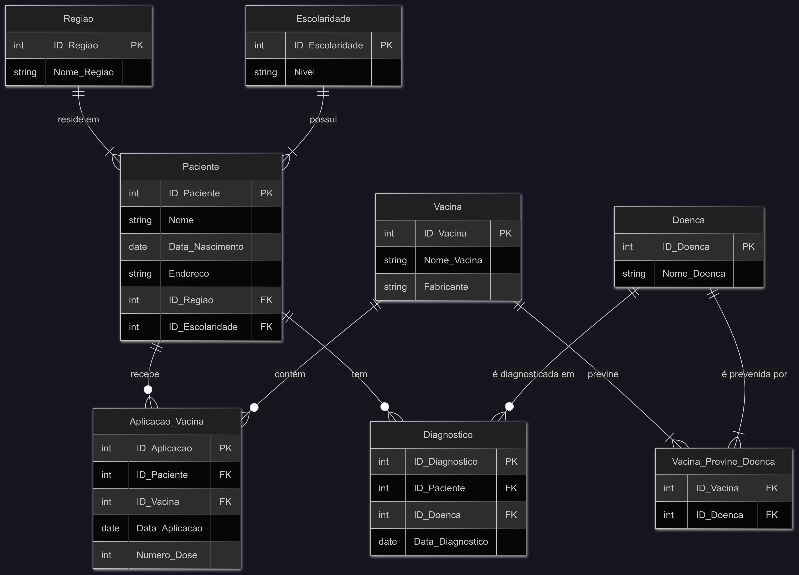
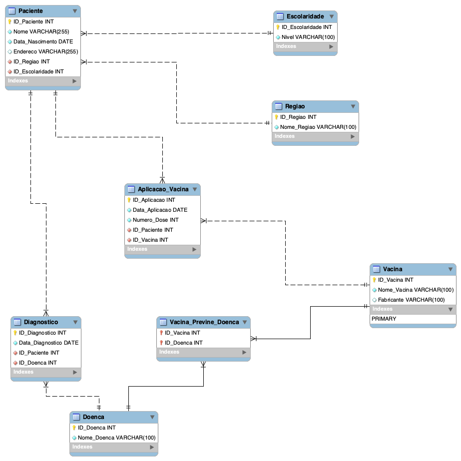
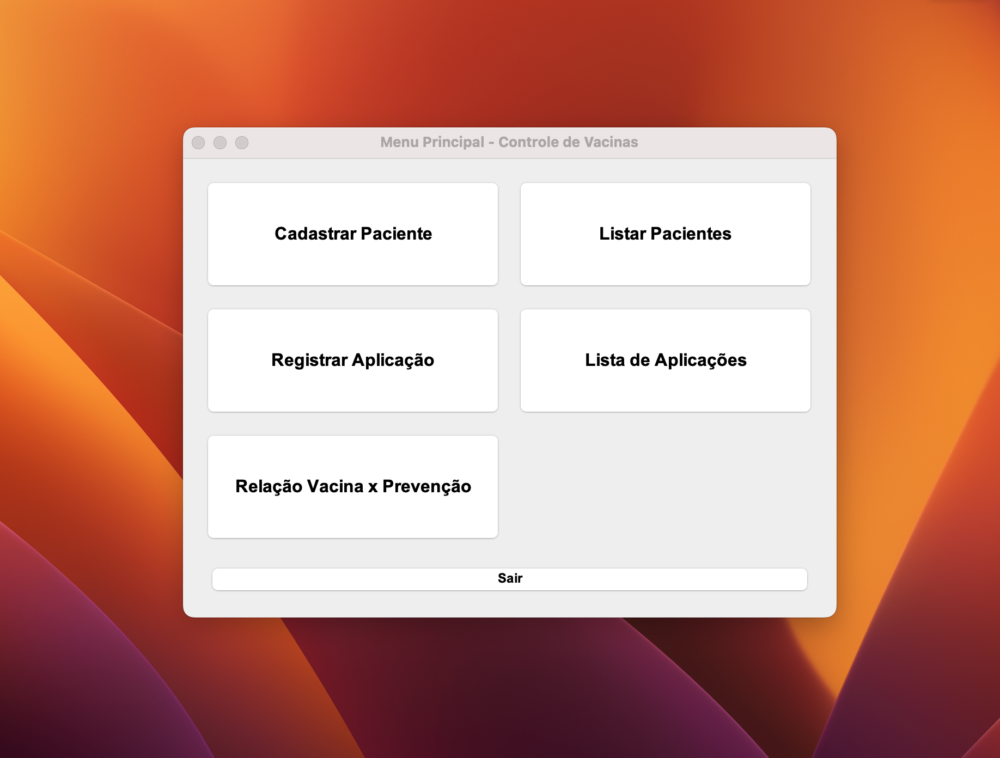
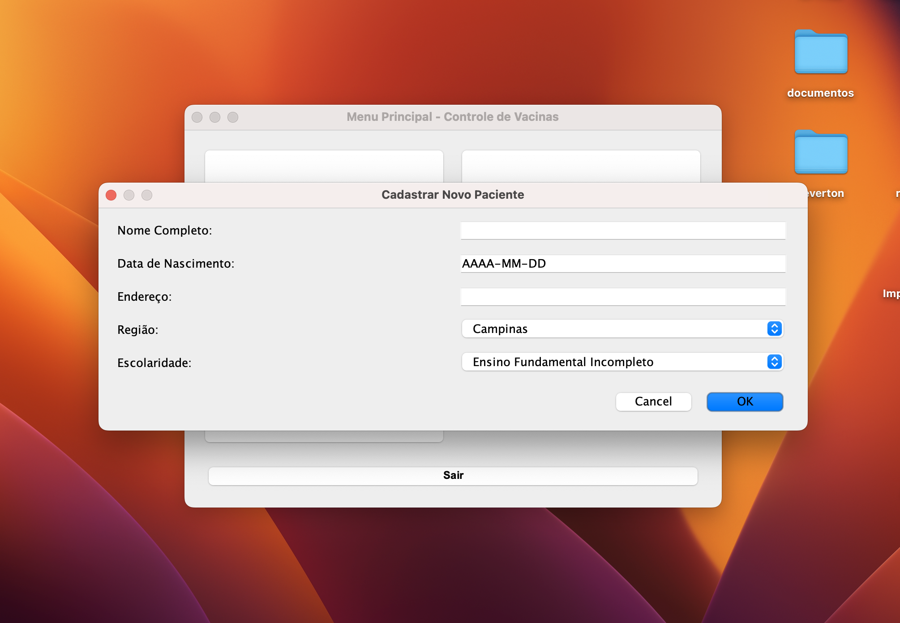
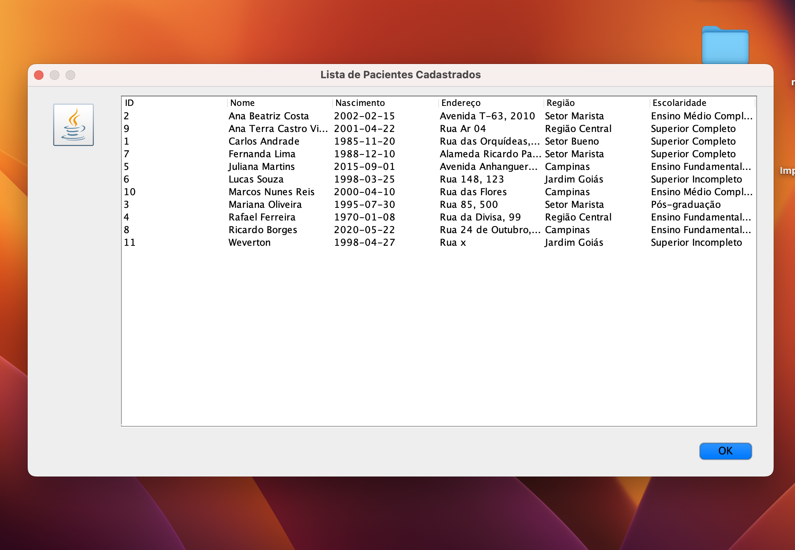
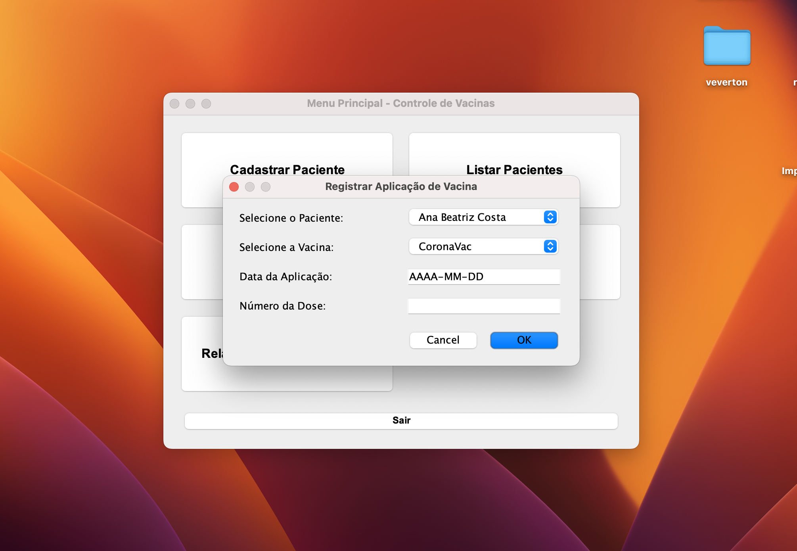
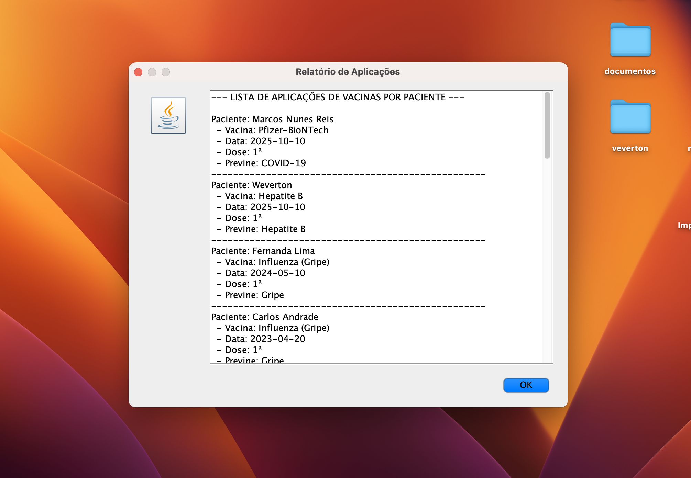
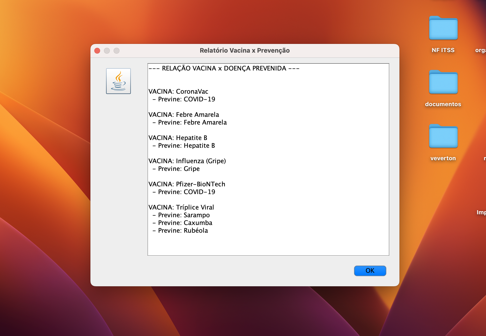

# Gerenciador de Aplicação de Vacinas

**Aluno:** Weverton Ferreira Rodrigues  
**Disciplina:** Projeto de Integração I-B  
**Repositório:** [GitHub - puc-contents](https://github.com/wevertoum/puc-contents/tree/master/projeto-integrador/projeto-integrador-1b-vaccine-managment)

---

## 1. Contextualização do Problema

A saúde pública enfrenta desafios crescentes com o aumento da desinformação e movimentos antivacina. Registrar, analisar e monitorar a vacinação da população é fundamental para prevenir surtos e direcionar campanhas de conscientização.

Este projeto propõe uma solução prática e acessível para profissionais da saúde, permitindo registrar e consultar aplicações de vacinas, pacientes e diagnósticos, com base em uma estrutura de banco de dados consistente e uma interface Java intuitiva.

---

## 2. Estrutura e Modelagem do Banco de Dados

Para garantir a integridade e performance dos dados, foi utilizado o MySQL como SGBD. A modelagem foi dividida em três etapas: conceitual, lógica e física.

<div style="page-break-after: always;"></div>

### 2.1. Modelo Conceitual

O modelo conceitual apresenta as principais entidades (Paciente, Vacina, Doença) e seus relacionamentos fundamentais.



<div style="page-break-after: always;"></div>

### 2.2. Modelo Lógico

Representa os relacionamentos e atributos com mais detalhamento técnico, utilizando chaves primárias e estrangeiras.



<div style="page-break-after: always;"></div>

### 2.3. Modelo Físico

O modelo físico é representado pelo script SQL que cria o schema `ControleVacinas` e suas respectivas tabelas:

```sql
SET @OLD_UNIQUE_CHECKS=@@UNIQUE_CHECKS, UNIQUE_CHECKS=0;
SET @OLD_FOREIGN_KEY_CHECKS=@@FOREIGN_KEY_CHECKS, FOREIGN_KEY_CHECKS=0;
SET @OLD_SQL_MODE=@@SQL_MODE, SQL_MODE='ONLY_FULL_GROUP_BY,STRICT_TRANS_TABLES,NO_ZERO_IN_DATE,NO_ZERO_DATE,ERROR_FOR_DIVISION_BY_ZERO,NO_ENGINE_SUBSTITUTION';

-- -----------------------------------------------------
-- Schema ControleVacinas
-- -----------------------------------------------------
-- Schema para armazenar dados de vacinação da população.
DROP SCHEMA IF EXISTS `ControleVacinas` ;
CREATE SCHEMA IF NOT EXISTS `ControleVacinas` DEFAULT CHARACTER SET utf8mb4 ;
USE `ControleVacinas` ;

-- -----------------------------------------------------
-- Table `ControleVacinas`.`Regiao`
-- -----------------------------------------------------
CREATE TABLE IF NOT EXISTS `ControleVacinas`.`Regiao` (
  `ID_Regiao` INT NOT NULL AUTO_INCREMENT,
  `Nome_Regiao` VARCHAR(100) NOT NULL,
  PRIMARY KEY (`ID_Regiao`))
ENGINE = InnoDB;


-- -----------------------------------------------------
-- Table `ControleVacinas`.`Escolaridade`
-- -----------------------------------------------------
CREATE TABLE IF NOT EXISTS `ControleVacinas`.`Escolaridade` (
  `ID_Escolaridade` INT NOT NULL AUTO_INCREMENT,
  `Nivel` VARCHAR(100) NOT NULL,
  PRIMARY KEY (`ID_Escolaridade`))
ENGINE = InnoDB;


-- -----------------------------------------------------
-- Table `ControleVacinas`.`Paciente`
-- -----------------------------------------------------
CREATE TABLE IF NOT EXISTS `ControleVacinas`.`Paciente` (
  `ID_Paciente` INT NOT NULL AUTO_INCREMENT,
  `Nome` VARCHAR(255) NOT NULL,
  `Data_Nascimento` DATE NOT NULL,
  `Endereco` VARCHAR(255) NULL,
  `ID_Regiao` INT NOT NULL,
  `ID_Escolaridade` INT NOT NULL,
  PRIMARY KEY (`ID_Paciente`),
  INDEX `fk_Paciente_Regiao_idx` (`ID_Regiao` ASC) VISIBLE,
  INDEX `fk_Paciente_Escolaridade_idx` (`ID_Escolaridade` ASC) VISIBLE,
  CONSTRAINT `fk_Paciente_Regiao`
    FOREIGN KEY (`ID_Regiao`)
    REFERENCES `ControleVacinas`.`Regiao` (`ID_Regiao`)
    ON DELETE NO ACTION
    ON UPDATE NO ACTION,
  CONSTRAINT `fk_Paciente_Escolaridade`
    FOREIGN KEY (`ID_Escolaridade`)
    REFERENCES `ControleVacinas`.`Escolaridade` (`ID_Escolaridade`)
    ON DELETE NO ACTION
    ON UPDATE NO ACTION)
ENGINE = InnoDB;


-- -----------------------------------------------------
-- Table `ControleVacinas`.`Vacina`
-- -----------------------------------------------------
CREATE TABLE IF NOT EXISTS `ControleVacinas`.`Vacina` (
  `ID_Vacina` INT NOT NULL AUTO_INCREMENT,
  `Nome_Vacina` VARCHAR(100) NOT NULL,
  `Fabricante` VARCHAR(100) NULL,
  PRIMARY KEY (`ID_Vacina`))
ENGINE = InnoDB;


-- -----------------------------------------------------
-- Table `ControleVacinas`.`Aplicacao_Vacina`
-- -----------------------------------------------------
CREATE TABLE IF NOT EXISTS `ControleVacinas`.`Aplicacao_Vacina` (
  `ID_Aplicacao` INT NOT NULL AUTO_INCREMENT,
  `Data_Aplicacao` DATE NOT NULL,
  `Numero_Dose` INT NOT NULL,
  `ID_Paciente` INT NOT NULL,
  `ID_Vacina` INT NOT NULL,
  PRIMARY KEY (`ID_Aplicacao`),
  INDEX `fk_Aplicacao_Vacina_Paciente_idx` (`ID_Paciente` ASC) VISIBLE,
  INDEX `fk_Aplicacao_Vacina_Vacina_idx` (`ID_Vacina` ASC) VISIBLE,
  CONSTRAINT `fk_Aplicacao_Vacina_Paciente`
    FOREIGN KEY (`ID_Paciente`)
    REFERENCES `ControleVacinas`.`Paciente` (`ID_Paciente`)
    ON DELETE CASCADE
    ON UPDATE NO ACTION,
  CONSTRAINT `fk_Aplicacao_Vacina_Vacina`
    FOREIGN KEY (`ID_Vacina`)
    REFERENCES `ControleVacinas`.`Vacina` (`ID_Vacina`)
    ON DELETE NO ACTION
    ON UPDATE NO ACTION)
ENGINE = InnoDB;


-- -----------------------------------------------------
-- Table `ControleVacinas`.`Doenca`
-- -----------------------------------------------------
CREATE TABLE IF NOT EXISTS `ControleVacinas`.`Doenca` (
  `ID_Doenca` INT NOT NULL AUTO_INCREMENT,
  `Nome_Doenca` VARCHAR(100) NOT NULL,
  PRIMARY KEY (`ID_Doenca`))
ENGINE = InnoDB;


-- -----------------------------------------------------
-- Table `ControleVacinas`.`Diagnostico`
-- -----------------------------------------------------
CREATE TABLE IF NOT EXISTS `ControleVacinas`.`Diagnostico` (
  `ID_Diagnostico` INT NOT NULL AUTO_INCREMENT,
  `Data_Diagnostico` DATE NOT NULL,
  `ID_Paciente` INT NOT NULL,
  `ID_Doenca` INT NOT NULL,
  PRIMARY KEY (`ID_Diagnostico`),
  INDEX `fk_Diagnostico_Paciente_idx` (`ID_Paciente` ASC) VISIBLE,
  INDEX `fk_Diagnostico_Doenca_idx` (`ID_Doenca` ASC) VISIBLE,
  CONSTRAINT `fk_Diagnostico_Paciente`
    FOREIGN KEY (`ID_Paciente`)
    REFERENCES `ControleVacinas`.`Paciente` (`ID_Paciente`)
    ON DELETE CASCADE
    ON UPDATE NO ACTION,
  CONSTRAINT `fk_Diagnostico_Doenca`
    FOREIGN KEY (`ID_Doenca`)
    REFERENCES `ControleVacinas`.`Doenca` (`ID_Doenca`)
    ON DELETE NO ACTION
    ON UPDATE NO ACTION)
ENGINE = InnoDB;


-- -----------------------------------------------------
-- Table `ControleVacinas`.`Vacina_Previne_Doenca`
-- -----------------------------------------------------
CREATE TABLE IF NOT EXISTS `ControleVacinas`.`Vacina_Previne_Doenca` (
  `ID_Vacina` INT NOT NULL,
  `ID_Doenca` INT NOT NULL,
  PRIMARY KEY (`ID_Vacina`, `ID_Doenca`),
  INDEX `fk_Vacina_has_Doenca_Doenca_idx` (`ID_Doenca` ASC) VISIBLE,
  INDEX `fk_Vacina_has_Doenca_Vacina_idx` (`ID_Vacina` ASC) VISIBLE,
  CONSTRAINT `fk_Vacina_has_Doenca_Vacina`
    FOREIGN KEY (`ID_Vacina`)
    REFERENCES `ControleVacinas`.`Vacina` (`ID_Vacina`)
    ON DELETE CASCADE
    ON UPDATE NO ACTION,
  CONSTRAINT `fk_Vacina_has_Doenca_Doenca`
    FOREIGN KEY (`ID_Doenca`)
    REFERENCES `ControleVacinas`.`Doenca` (`ID_Doenca`)
    ON DELETE CASCADE
    ON UPDATE NO ACTION)
ENGINE = InnoDB;


SET SQL_MODE=@OLD_SQL_MODE;
SET FOREIGN_KEY_CHECKS=@OLD_FOREIGN_KEY_CHECKS;
SET UNIQUE_CHECKS=@OLD_UNIQUE_CHECKS;
```

O script pode ser executado via MySQL ou terminal para construir a base de dados.

---

<div style="page-break-after: always;"></div>

## 3. Funcionalidades do Sistema (Java)

O sistema foi desenvolvido em Java utilizando a JOptionPane para a interface e JDBC para a conexão com o banco. A seguir, apresenta-se uma descrição das telas principais:


  Tela inicial com acesso centralizado para todas as funcionalidades do sistema.


  Formulário para cadastro de pacientes, com campos para nome, endereço, região e escolaridade.


  Tabela que lista os pacientes cadastrados com dados detalhados.


  Tela para registrar aplicações de vacinas aos pacientes.


  Relatório com todas as aplicações de vacinas, doses e datas.


  Gráfico ou relação visual entre vacinas e as doenças que elas previnem.
