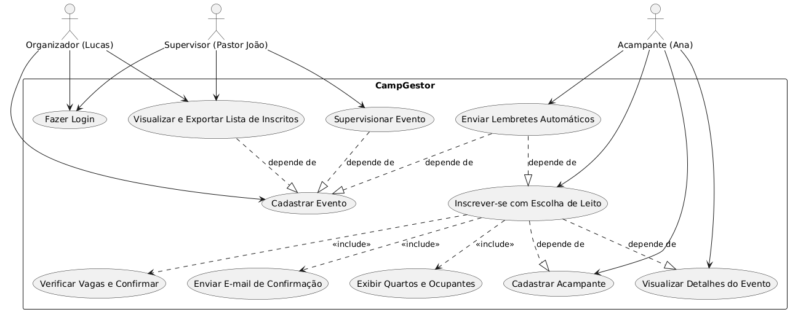

# Diagrama de Casos de Uso

O diagrama acima representa os casos de uso do "CampGestor", um sistema de gerenciamento de eventos para acampamentos desenvolvido no Projeto Integrador II-B. Ele ilustra as interações entre os usuários (organizadores, supervisores e acampantes) e as principais funcionalidades da plataforma, como cadastro de eventos, inscrição em acampamentos, escolha de leitos e geração de relatórios, destacando a automação e a eficiência no contexto de organização de acampamentos para igrejas.
